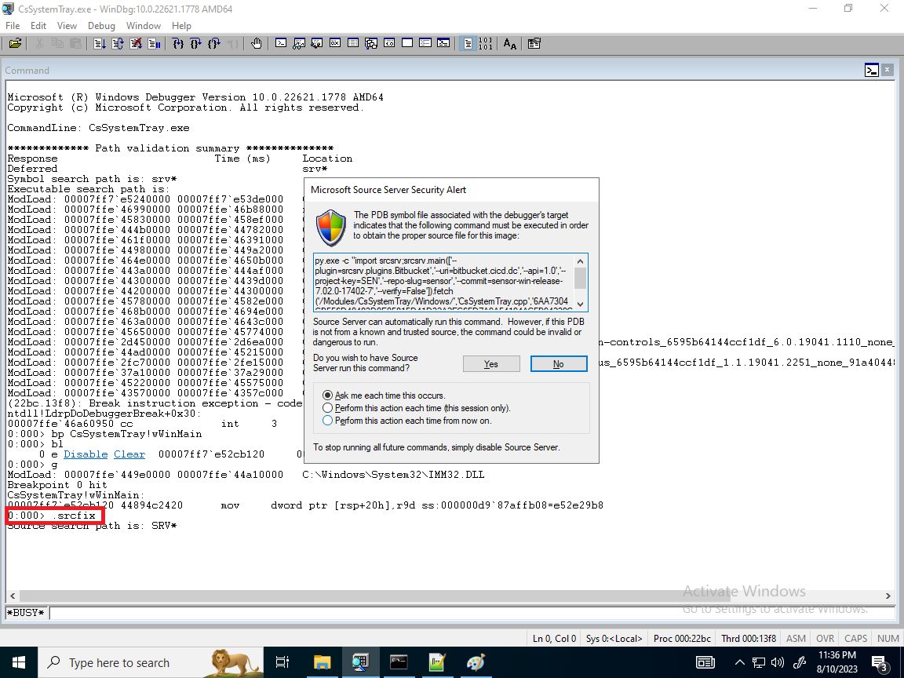
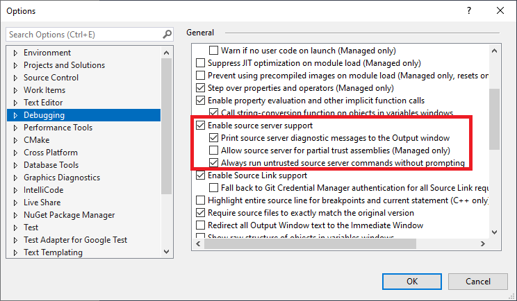
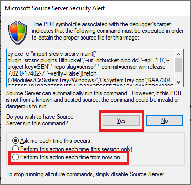

<!--
 SETUP.md - Source indexing setup information

 Copyright (C) 2023 Uri Mann (abba.mann@gmail.com)

 Permission is hereby granted, free of charge, to any person obtaining a copy
 of this software and associated documentation files (the "Software"), to deal
 in the Software without restriction, including without limitation the rights
 to use, copy, modify, merge, publish, distribute, sublicense, and/or sell
 copies of the Software, and to permit persons to whom the Software is
 furnished to do so, subject to the following conditions:

 The above copyright notice and this permission notice shall be included in all
 copies or substantial portions of the Software.

 THE SOFTWARE IS PROVIDED "AS IS", WITHOUT WARRANTY OF ANY KIND, EXPRESS OR
 IMPLIED, INCLUDING BUT NOT LIMITED TO THE WARRANTIES OF MERCHANTABILITY,
 FITNESS FOR A PARTICULAR PURPOSE AND NONINFRINGEMENT. IN NO EVENT SHALL THE
 AUTHORS OR COPYRIGHT HOLDERS BE LIABLE FOR ANY CLAIM, DAMAGES OR OTHER
 LIABILITY, WHETHER IN AN ACTION OF CONTRACT, TORT OR OTHERWISE, ARISING FROM,
 OUT OF OR IN CONNECTION WITH THE SOFTWARE OR THE USE OR OTHER DEALINGS IN THE
 SOFTWARE.
-->
# Setup and use of source indexing
## Table of Content
- [Setup and use of source indexing](#setup-and-use-of-source-indexing)
  - [Table of Content](#table-of-content)
- [Building and indexing symbol (**.PDB**) files](#building-and-indexing-symbol-pdb-files)
- [Using source indexed symbols for debugging](#using-source-indexed-symbols-for-debugging)


# Building and indexing symbol (**.PDB**) files
In order to instrument **.PDB** files for debugging the Microsoft [Debugging Tools for Windows](https://learn.microsoft.com/en-us/windows-hardware/drivers/debugger/debugger-download-tools) must be installed on the host where the indexing takes place.

If your build is already driven by a Python script simply import this package and call main() function with the parameters required by your build system and repository.  
Example:

```python
import os
import srcsrv

srcsrv.main(
    [
        '--build-base', r'c:\builds\ver1.1.0',
        '--pdbs', 'debug', 'release',
        '--commit', os.environ['GIT_SHA'],
        # ...more...
    ]
)
```

For batch file driven builds I'd recommend to warp your Python script into a batch file. The parameters can be fed into the package on the commend line.  
Example:

```bat
1>2# : ^
'''
@echo running python
@python "%~f0" %*
@exit /b !ERRORLEVEL!
rem ^
'''
import srcsrv
srcsrv.main()
```
This Windows batch script allow to mix shell and python scripts for convince. The syntax takes advantage to both python and shell comments to separate the two languages.  

# Using source indexed symbols for debugging
The Microsoft debugging tool chain has builtin support for source indexed **.PDB** files. It allows symbols for both **C/C++** native code and **C#** to be instrumented. Once this is done it is just a matter of enabling the debuggers to take advantage of it.
1. WinDBG classic - Enabling is done in one of four ways.
>>a. On the command line invoke the debugger with [-srcpath SRV*](https://learn.microsoft.com/en-us/windows-hardware/drivers/debugger/windbg-command-line-options#:~:text=Specifies%20the%20source%20file%20search%20path.%20Separate%20multiple%20paths%20with%20a%20semicolon%20(%3B).%20If%20the%20path%20contains%20spaces%2C%20it%20should%20be%20enclosed%20in%20quotation%20marks.%20For%20details%2C%20and%20for%20other%20ways%20to%20change%20this%20path%2C%20see%20Source%20Path.) option    
b. Setting *%[_NT_SOURCE_PATH](https://learn.microsoft.com/en-us/windows-hardware/drivers/debugger/general-environment-variables)%* environment variable to **SRV***.  
c. Open **File > Source file path... (Ctrl+P)** dialog and type **SRV***   
d. Type **.srcfix** at the debugger command prompt  

2. The same options will also work for **WinDBG Preview**  
3. For Visual Studio IDE select from the menu **Tools > Options... > Debugging** and check **Enable source sever support**

The first time you start source server debugging you will be presented with a dialog warning you about invoking the source server command. This is done for security reasons since if a malicious actor manage to modify your symbol files the debugger will run their commands.  
  
You're given one of three options
1. Prompt for each file as it is loaded. If the file already cached, no prompt is given.
2. Do not prompt again for the rest of the current debugging session. You will be prompt when a new debugging session starts and additional files are fetched.
3. Select **Perform this action each time from now on** and you will never be prompted again.